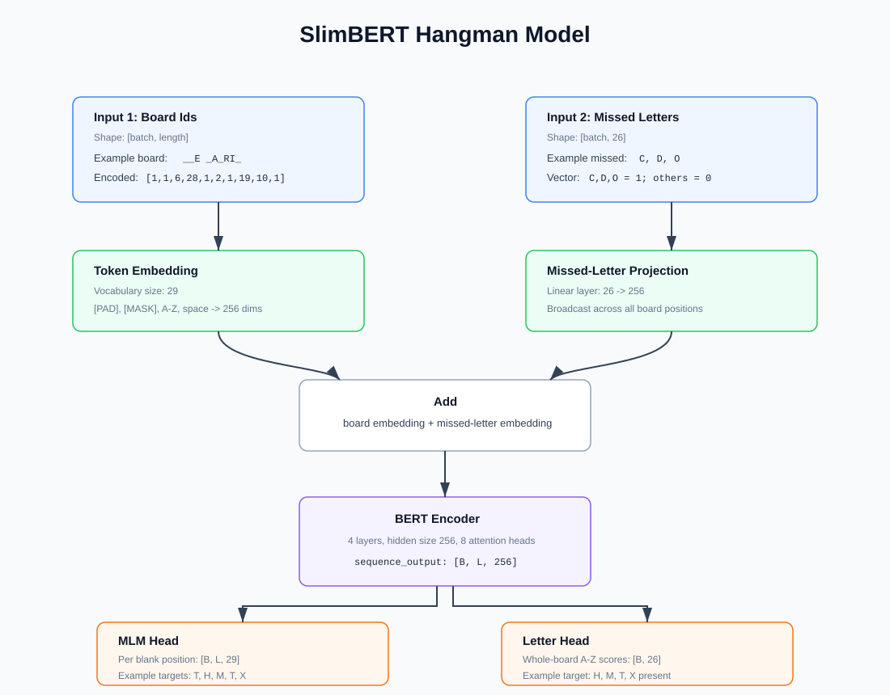
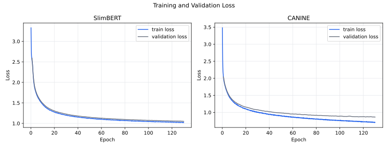
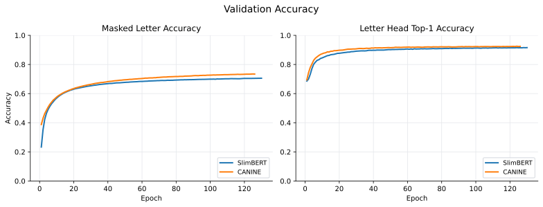
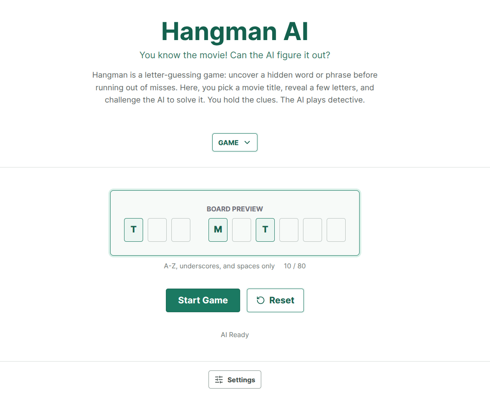

# Hangman

Can a language model solve Hangman when the hidden phrase is a movie title? That is the question behind this project. Movie titles have enough structure to learn from, but they are also messy in useful ways: short words, names, rare letters, odd spellings, and titles that do not behave like plain dictionary English. The goal is to see how far simple guessing, character-level models, and a little search can go in that setting.


## Game

Hangman is a word guessing game. One player thinks of a word or phrase, and the other player guesses one letter at a time. Correct guesses reveal all matching positions. Wrong guesses count as failures. The game ends when the phrase is solved or the failure limit is reached.

In this project, the hidden phrase is an English movie title. The board starts with at least one letter revealed in every word, and the player must guess the remaining letters. Spaces are already known, and guesses are made over `A-Z` only.

## Strategies

The game can be played with a few simple baselines before moving to learned models.

1. Random: Pick any unguessed letter.
2. Frequency-based: Guess common letters first, either from general English or from the movie-title dataset.
3. Candidate-based: Filter possible titles or words using the revealed pattern and wrong guesses, then guess from the remaining candidate set.
4. Entropy-based: Choose the letter that gives the highest expected information gain over the candidate set.
5. N-gram model: Use local character patterns from the revealed letters to score likely missing letters.
6. Learned language model: Use a trained model to score likely missing letters from the current board state and wrong guesses.

All strategies follow the same loop: exclude already revealed and wrong letters, make one guess, update the board, then repeat until the title is solved or the failure limit is reached.

Since every word starts with at least one revealed letter, the best case is solving the title in one guess when only one hidden letter remains. Ignoring the failure limit, the worst theoretical case is 25 guesses, because at least one of the 26 letters is already visible.

The main experiments in this project focus on the learned language-model strategy.

## Setup

The project uses Python `3.13` and `uv` for dependency management.

```bash
git clone https://github.com/anilsathyan7/hangman-ai.git
cd hangman-ai
uv sync
```

Download the trained checkpoints before running play or evaluation:

```bash
hf download ansat7/hangman-slimbert \
  --local-dir checkpoints/slimbert

hf download ansat7/hangman-canine \
  --local-dir checkpoints/canine
```

A CUDA GPU is recommended for training and full evaluation. SlimBERT inference can run on CPU, but GPU is much faster for large eval runs and CANINE.

## Dataset

The final Hangman title dataset combines two TMDB sources:

- Hugging Face dataset: `ada-datadruids/full_tmdb_movies_dataset`
- TMDB [daily ID export files](https://developer.themoviedb.org/docs/daily-id-exports), used to refresh and extend the movie-title pool

The cleaned title file is `datasets/hangman_dataset.csv`. The same dataset is also available on Hugging Face as `ansat7/hangman_english`.

`datasets/index.csv` is a separate single-word lookup file used during late-game guessing. It is not the main training dataset. It helps search possible words from a revealed pattern, using title words plus supporting word sources such as dictionary words, names, countries, brands, and animals.

### Dataset Preprocessing

- Keep English movie titles and remove empty titles.
- Remove titles with numbers.
- Normalize titles to uppercase ASCII.
- Keep only `A-Z` and spaces.
- Collapse repeated spaces.
- Deduplicate titles.
- Split titles into fixed `80/10/10` train, validation, and test sets.
- Filter titles by model length during loading.
- Build `datasets/index.csv` as a single-word lookup list from title words plus supporting word sources.
- Remove duplicate, malformed, and obvious noisy index words.

### Dataset Statistics

| Metric | Value |
| --- | ---: |
| Movie titles | `619,708` |
| Unique movie titles | `619,708` |
| Average title length | `21.39` characters |
| Average words per title | `3.86` |
| Indexed words | `178,181` |
| Maximum indexed word length | `29` |

### Game State

Each training example is one board state made from a cleaned movie title.

Example:

- Title: `THE MATRIX`
- Board: `__E _A_RI_`
- Missed letters: `C, D, O`

The dataset row stores both the model inputs and the training targets.

| Field | Meaning | Example |
| --- | --- | --- |
| `pattern` | Text board for inspection and character models. | `__E _A_RI_` |
| `input_ids` | Same board encoded for SlimBERT, with blanks as `[MASK]`. | `[MASK] [MASK] E   [MASK] A [MASK] R I [MASK]` |
| `missed_letters` | 26-way multi-hot vector for wrong guesses already made. | `C, D, O` marked as `1` |
| `labels` | Per-position targets for masked letters. Visible letters and spaces use `-100`. | `T, H, -100, -100, M, -100, T, -100, -100, X` |
| `letter_labels` | 26-way multi-hot target for hidden letters anywhere in the title. | `H, M, T, X` marked as `1` |

During play, the model scores the next unguessed letter, the board is updated, and the same state is rebuilt for the next guess.

Titles have different lengths, so examples are padded only when a batch is created. Padding keeps tensors the same length inside the batch and is ignored by the model loss.

## Models

We compare two character-level models for the learned strategy. SlimBERT is a small model trained from scratch on the movie-title dataset. CANINE is Google’s pretrained `google/canine-c` character model, adapted to the same Hangman setup.

Both models use the same game state. The board tells the model what is already visible, and `missed_letters` tells it which guesses were already wrong.

Both models have two heads:

- MLM head: A masked language modeling head. It predicts the missing character at each hidden position. For `__E _A_RI_`, this head learns the blank targets `T, H, M, T, X`.
- Letter head: A multi-label classification head over `A-Z`. It predicts which letters are hidden anywhere in the title. For the same board, this is a 26-way target with `H, M, T, X` marked as present.

The final training loss is the MLM loss plus the letter-head loss. Visible letters, spaces, and padding are ignored in the MLM loss.

The SlimBERT flow is shown below with one real board example and the ids used by the custom vocabulary.



### SlimBERT

SlimBERT is a small BERT-style model trained from scratch on the cleaned movie-title data. It uses the custom vocabulary: `[PAD]`, `[MASK]`, `A-Z`, and space.

Main features:

- Uses a small custom vocabulary: `[PAD]`, `[MASK]`, `A-Z`, and space.
- Uses `input_ids`, where hidden letters are `[MASK]`.
- Adds the missed-letter vector into the token embeddings, so the encoder knows which letters are already ruled out.
- Uses the shared MLM and letter heads.
- Small and fast enough for repeated experiments.

### CANINE

CANINE is a pretrained character-level model. It reads the board as text, so hidden letters are underscores in the `pattern` string.

Main features:

- Uses pretrained `google/canine-c` character representations.
- Reads the `pattern` text directly, with underscores for blanks.
- Uses the CANINE tokenizer for padding, special tokens, and attention masks.
- Does not need the custom SlimBERT `[MASK]` token.
- Uses the same missed-letter injection idea.
- Supports full fine-tuning or LoRA fine-tuning.

### Model Size

| Model | Layers | Hidden size | Attention heads | FFN size | Max length | Parameters |
| --- | ---: | ---: | ---: | ---: | ---: | ---: |
| SlimBERT | `4` | `256` | `8` | `1,024` | `128` | `3.29M` |
| CANINE | `12` | `768` | `12` | `3,072` | `16,384` | `132.15M` |

CANINE can also be trained with LoRA. In that setup the full model is still loaded, but only about `3.18M` parameters are trainable.

### Trained Checkpoints

Fully trained SlimBERT and CANINE checkpoints are published on Hugging Face. The Setup section shows how to download them into the local `checkpoints/` folders before running play or evaluation.

## Design Choices

The main design idea is to make the model see the same information a Hangman player sees: the board, the revealed letters, and the wrong guesses so far.

| Component | Why It Is Used | How It Helps |
| --- | --- | --- |
| MLM head | Predicts the letter at each blank position. | Uses local board context, such as `_A_RI_`, to score position-specific letters. |
| Multi-label head | Predicts which `A-Z` letters are hidden anywhere in the title. | Matches the game action more directly, because Hangman guesses one letter, not one position. |
| Wrong-letter input | Passes missed guesses as a 26-way vector. | Lets the model know which letters are already ruled out instead of only filtering them after prediction. |
| Index fallback | Uses an inverted word index for late-game candidate lookup. | Helps when a word is almost solved but the missing letter is rare or title-specific. |
| Late-game sampling | Adds about `30%` extra samples with only a few hidden letters. | Gives the model more practice on the failure pattern seen near the end of games. |
| Pretrained CANINE | Starts from Google's character-level `google/canine-c` model. | Tests whether pretrained character knowledge helps compared with training from scratch. |
| Custom SlimBERT | Uses a small BERT-style model with the exact Hangman vocabulary. | Keeps experiments fast, simple, and focused on `A-Z`, space, `[MASK]`, and `[PAD]`. |

## Training

Training uses Hugging Face `Trainer` for both models. The title split is fixed at `80/10/10` for train, validation, and test. Training boards are generated dynamically, so the same title can appear with different revealed letters and missed guesses across epochs. Validation boards are fixed with a seed, which makes runs comparable.

Weights & Biases is used for training logs, metric tracking, and run comparison.

Loss:

- MLM loss: PyTorch `CrossEntropyLoss`, computed over masked positions only. Visible letters, spaces, and padding use `-100`.
- Letter loss: PyTorch `BCEWithLogitsLoss`, computed over the 26 hidden-letter labels.
- Final loss: `MLM loss + letter loss`.

Metrics:

- `masked_accuracy`: Accuracy on hidden letter positions only.
- `top1_accuracy`: Whether the top letter-head prediction is one of the hidden letters.

### SlimBERT Training

SlimBERT uses a custom collator. It pads `input_ids` with `[PAD]`, builds the `attention_mask`, pads MLM labels with `-100`, and keeps `missed_letters` and `letter_labels` as 26-way vectors.

SlimBERT does not read raw characters directly. The dataset uses `CHAR_TO_ID` to convert visible letters, spaces, `[MASK]`, and `[PAD]` into integer ids before training.

The main SlimBERT training settings are:

| Setting | Value |
| --- | --- |
| Script | `train_slimbert_hangman.py` |
| Batch size | `1024` |
| Epochs | `130` |
| Learning rate | `3e-4` |
| LR policy | Reduce on plateau, factor `0.5`, patience `5`, min LR `1.5e-5` |
| Eval/save | Every epoch |
| Best checkpoint | Lowest `eval_loss` |
| Precision | `bf16` |

Run:

```bash
python3 train_slimbert_hangman.py \
  --dataset-name datasets/hangman_dataset.csv \
  --output-dir hangman_slimbert \
  --run-name hangman-slimbert \
  --epochs 130
```

Args:

- `--dataset-name`: Local cleaned title CSV. Defaults to `datasets/hangman_dataset.csv`.
- `--output-dir`: Folder where Trainer checkpoints are written.
- `--run-name`: Weights & Biases run name.
- `--epochs`: Total number of training epochs.
- `--resume-from-checkpoint`: Optional checkpoint path for continuing an interrupted run.

### CANINE Training

CANINE uses the CANINE tokenizer inside the collator. The collator tokenizes `pattern`, lets the tokenizer create padding and attention masks, and adds `-100` labels for CANINE special tokens and padding.

CANINE receives the raw `pattern` string and lets the tokenizer create ids, special tokens, padding, and attention masks.

The main CANINE training settings are:

| Setting | Value |
| --- | --- |
| Script | `train_canine_hangman.py` |
| Batch size | `256` |
| Gradient accumulation | `2` |
| Epochs | `130` |
| Learning rate | `3e-5` full fine-tune, `5e-4` with LoRA |
| LR policy | Reduce on plateau, factor `0.5`, patience `5`, min LR `1.5e-6` |
| Warmup | `0` steps |
| Eval/save | Every epoch |
| Best checkpoint | Lowest `eval_loss` |
| Precision | `bf16` |

Run:

```bash
python3 train_canine_hangman.py \
  --dataset-name datasets/hangman_dataset.csv \
  --output-dir hangman_canine \
  --run-name hangman-canine \
  --epochs 130
```

Args:

- `--dataset-name`: Local cleaned title CSV. Defaults to `datasets/hangman_dataset.csv`.
- `--output-dir`: Folder where Trainer checkpoints are written.
- `--run-name`: Weights & Biases run name.
- `--epochs`: Total number of training epochs.
- `--batch-size`: Per-device train batch size.
- `--gradient-accumulation-steps`: Multiplies effective batch size without increasing memory as much.
- `--learning-rate`: Optional override; defaults to `3e-5` for full fine-tuning and `5e-4` with LoRA.
- `--use-lora`: Train LoRA adapters instead of full fine-tuning.
- `--resume-from-checkpoint`: Optional checkpoint path for continuing an interrupted run.

The best CANINE checkpoint so far is `checkpoints/canine/checkpoint-179660` from epoch `130`, with `eval_loss=0.8630`, `masked_accuracy=0.7677`, and `top1_accuracy=0.9380`.

### Training Curves

The loss plot keeps train and validation loss together for each model. The accuracy plot compares the validation metrics across SlimBERT and CANINE. The CANINE curves use the local-dataset epoch-130 checkpoint.





- CANINE ends with better validation loss and accuracy, but the gap is smaller in gameplay than in validation.
- Both models were still improving near the end, though the gains had become gradual.

## Play

At play time, the model is used as a next-letter guesser. The game keeps three pieces of state: the current board, the guessed letters, and the missed letters.

Basic loop:

1. Start from the current board pattern, guessed letters, and missed letters.
2. Encode the board, including revealed letters and blanks, for the selected model.
3. Encode missed letters as a 26-way multi-hot vector.
4. Run one forward pass to get MLM scores and 26-way letter scores.
5. Score each unguessed letter using the blended score below.
6. Guess the highest-scoring letter.
7. Add the guessed letter to the guessed-letter set.
8. If the letter is present, reveal all matching positions on the board.
9. If the letter is absent, add it to `missed_letters` and increase the fail count.
10. Repeat with the updated board, guessed letters, and missed letters until the title is solved or the fail limit is reached.

For each candidate letter `l`, the MLM head gives a per-blank score:

```text
mlm_score(l) = 1 - product(1 - P(l at blank_i))
```

This is the model's estimate that `l` appears in at least one blank. The letter head gives a direct whole-board score:

```text
letter_score(l) = sigmoid(letter_logit_l)
```

The final guess score is a weighted blend. `mlm_weight` controls the per-position masked-letter score, and `letter_weight` controls the whole-board hidden-letter score.

```text
score(l) = letter_weight * letter_score(l) + mlm_weight * mlm_score(l)
```

### SlimBERT Play

SlimBERT plays from encoded character ids.

Steps:

1. Take the updated board pattern from the current loop step.
2. Convert the board to `input_ids`: revealed letters and spaces keep their ids, and `_` blanks become `[MASK]`.
3. Build the `missed_letters` vector from wrong guesses.
4. Use an all-ones `attention_mask` for the single title.
5. Run the model with `input_ids`, `attention_mask`, and `missed_letters`.
6. Read MLM probabilities at `[MASK]` positions and blend them with letter-head scores.
7. Skip already guessed letters and pick the highest-scoring remaining letter.
8. Return the chosen letter to the shared game loop, which reveals hits or records misses.

Example:

```text
Current board: __E _A_RI_
Guessed letters so far: E, A, R, I
Missed letters: C, D, O
Blank positions: 0, 1, 4, 6, 9
Candidate letter: T
MLM score: T across blank positions
Final score: letter_weight * letter score + mlm_weight * MLM score
Chosen guess: T
Updated board after hit: T_E _ATRI_
```

### CANINE Play

CANINE plays from the raw board pattern.

Steps:

1. Take the updated board pattern from the current loop step.
2. Pass the `pattern` string to the CANINE tokenizer, including revealed letters, spaces, and `_` blanks.
3. Build the `missed_letters` vector from wrong guesses.
4. Let the tokenizer create input ids, special tokens, padding, and the attention mask.
5. Run the model with tokenizer outputs and `missed_letters`.
6. Read MLM probabilities at blank positions, shifted by one for CANINE's leading special token.
7. Blend MLM and letter-head scores, skip already guessed letters, and pick the best remaining letter.
8. Return the chosen letter to the shared game loop, which reveals hits or records misses.

Example:

```text
Current board: __E _A_RI_
Guessed letters so far: E, A, R, I
Missed letters: C, D, O
Blank positions on board: 0, 1, 4, 6, 9
Blank positions in CANINE output: 1, 2, 5, 7, 10
Candidate letter: T
MLM score: T across shifted blank positions
Final score: letter_weight * letter score + mlm_weight * MLM score
Chosen guess: T
Updated board after hit: T_E _ATRI_
```

## Fallback

The fallback is a small word lookup used near the end of a game. The model still makes the normal guesses. The lookup only helps when a word has enough revealed letters that the remaining candidates are narrow.

It uses `datasets/index.csv`, a single-word list built from title words and supporting word sources. In code, this is loaded into a simple inverted index keyed by word length, revealed letter position, and missed letters. This is useful for cases where the model has the shape mostly right, but keeps spending guesses on common letters before reaching a rare one.

The default game limit is `8` wrong guesses. The fallback is off by default. When enabled with `--use-index`, `--index-late-fails` controls how late it starts: `1`, `2`, or `3` means only use the lookup when there are that many fail slots left.

Steps:

1. Split the current board into words.
2. Skip words that are already solved.
3. For each unfinished word, search indexed words with the same length.
4. Keep only candidates that match the revealed letters.
5. Remove candidates containing missed letters.
6. Score each candidate with the model's MLM probabilities at the blank positions.
7. Average the score by the number of blanks, so shorter words do not automatically win.
8. Pick the best candidate, then guess one of its hidden letters using the model's normal letter score.

Example:

```text
Current word: _AD
Missed letters: E, N, R, T
Candidates after lookup: BAD, DAD, HAD, WAD
Model-scored candidates: BAD=0.21, DAD=0.18, HAD=0.14, WAD=0.47
Best candidate: WAD
Next guess from candidate: W
Updated word after hit: WAD
```

When enabled, it does not replace the model for the whole game. It only nudges late guesses when the candidate set is useful.

## Evaluation Suite

The evaluation suite runs complete Hangman games on the fixed test split. This is separate from the Trainer validation metrics: here the model must play the game step by step, update the board after every guess, and stay within the failure limit.

The same flow is used for SlimBERT and CANINE.

Steps:

1. Load the best saved checkpoint for the selected model.
2. Rebuild the fixed test split with the same dataset seed.
3. Start each game from the stored test pattern.
4. Let the model guess one letter at a time.
5. Update the board on hits and add wrong guesses to `missed_letters`.
6. Stop when the title is solved or the game reaches `8` wrong guesses.
7. Save failed games with the full guess sequence for later error analysis.

Run SlimBERT with the late-game index fallback:

```bash
python3 eval_slimbert_hangman.py \
  --use-index \
  --index-late-fails 2
```

Run CANINE with the late-game index fallback:

```bash
python3 eval_canine_hangman.py \
  --use-index \
  --index-late-fails 2
```

Args:

- `--dataset-name`: Local cleaned title CSV used to rebuild the fixed test split.
- `--model-dir`: Checkpoint root to evaluate.
- `--max-fails`: Wrong-guess limit per game.
- `--letter-weight` and `--mlm-weight`: Blend the letter head and MLM head scores.
- `--use-index`: Enable the late-game lookup fallback.
- `--index-late-fails`: Start the fallback when this many fail slots remain.
- `--max-index-candidates`: Skip lookup when a word has too many candidates.
- `--use-lora`: CANINE only; load a LoRA checkpoint instead of the full checkpoint.

Metrics:

- `win_rate`: Fraction of test titles solved within the fail limit: `wins / games`.
- `avg_fails`: Average wrong guesses per game: `total wrong guesses / games`.
- `avg_guesses`: Average total guesses per game: `total guesses / games`.
- `avg_score`: Higher for wins with fewer wrong guesses: `mean(1 - fails / max_fails)` for wins; losses score `0`.
- `failures`: Number of titles not solved within the fail limit: `games - wins`.

Current best Trainer validation result:

| Model | Checkpoint | Eval loss | Masked accuracy | Top-1 accuracy |
| --- | --- | ---: | ---: | ---: |
| SlimBERT | `checkpoints/slimbert/checkpoint-89830` | `1.0504` | `0.7056` | `0.9156` |
| CANINE | `checkpoints/canine/checkpoint-179660` | `0.8630` | `0.7677` | `0.9380` |

Latest saved gameplay results:

| Model | Weights | Fallback | Games | Max fails | Failures | Win rate |
| --- | --- | --- | ---: | ---: | ---: | ---: |
| SlimBERT | `letter=0.0`, `mlm=1.0` | Off | `43,896` | `8` | `1,366` | `0.9689` |
| SlimBERT | `letter=0.0`, `mlm=1.0` | Index on, late `2` | `43,896` | `8` | `445` | `0.9899` |
| CANINE | `letter=0.0`, `mlm=1.0` | Off | `61,892` | `8` | `4,262` | `0.9311` |
| CANINE | `letter=0.0`, `mlm=1.0` | Index on, late `2` | `61,892` | `8` | `1,269` | `0.9795` |

Gameplay runs with 10 and 12 maximum fails use `letter=0.0`, `mlm=1.0` on the current fixed 61,892-title test split:

| Model | Fallback | Games | Max fails | Failures | Win rate |
| --- | --- | ---: | ---: | ---: | ---: |
| SlimBERT | Off | `61,892` | `10` | `770` | `0.9876` |
| SlimBERT | Index on, late `2` | `61,892` | `10` | `234` | `0.9962` |
| CANINE | Off | `61,892` | `10` | `2,407` | `0.9611` |
| CANINE | Index on, late `2` | `61,892` | `10` | `670` | `0.9892` |
| SlimBERT | Off | `61,892` | `12` | `402` | `0.9935` |
| SlimBERT | Index on, late `2` | `61,892` | `12` | `113` | `0.9982` |
| CANINE | Off | `61,892` | `12` | `1,318` | `0.9787` |
| CANINE | Index on, late `2` | `61,892` | `12` | `334` | `0.9946` |

### Hard-Word Test

The 25-word hard set focuses on unusual letter patterns such as `JAZZ`, `SYZYGY`, and `RHYTHM`. Each distinct letter is used once as the initially revealed letter, producing `106` deterministic game states. This is a stress test, not a replacement for the movie-title test split.

| Max fails | Index | Model | Games | Failures | Win rate | Avg score |
| ---: | --- | --- | ---: | ---: | ---: | ---: |
| `8` | Off | SlimBERT | `106` | `63` | `0.4057` | `0.1851` |
| `8` | Off | CANINE | `106` | `65` | `0.3868` | `0.1403` |
| `8` | On | SlimBERT | `106` | `39` | `0.6321` | `0.2288` |
| `8` | On | CANINE | `106` | `40` | `0.6226` | `0.1851` |
| `10` | Off | SlimBERT | `106` | `49` | `0.5377` | `0.2491` |
| `10` | Off | CANINE | `106` | `44` | `0.5849` | `0.2179` |
| `10` | On | SlimBERT | `106` | `27` | `0.7453` | `0.2887` |
| `10` | On | CANINE | `106` | `27` | `0.7453` | `0.2472` |
| `12` | Off | SlimBERT | `106` | `26` | `0.7547` | `0.3247` |
| `12` | Off | CANINE | `106` | `34` | `0.6792` | `0.2893` |
| `12` | On | SlimBERT | `106` | `22` | `0.7925` | `0.3357` |
| `12` | On | CANINE | `106` | `15` | `0.8585` | `0.3145` |

- The late-game index improves the 8-miss win rate by about `22-24` percentage points for both models.
- More allowed misses help substantially on these words; the strongest run is indexed CANINE at `12` misses, with `15 / 106` failures.
- These results are intentionally much lower than the title-split results because the test set concentrates uncommon letters and awkward spelling patterns.

## ONNX Export

SlimBERT can be exported from its PyTorch checkpoint to ONNX for deployment in another runtime, such as ONNX Runtime or a browser application.

- Inputs: `input_ids` for the board and `missed_letters` for wrong guesses.
- Outputs: MLM logits and 26-way letter-head logits for the normal game loop.
- Board length: Dynamic from `1` to `80` characters.

The optional FP16 copy converts supported internal weights and operations from FP32 to FP16 while keeping its inputs and outputs as FP32. FP16 reduces the model file size and can improve inference on a compatible GPU; use the FP32 model for CPU inference. The conversion follows [ONNX Runtime FP16 conversion](https://onnxruntime.ai/docs/performance/model-optimizations/float16.html).

Export both versions:

```bash
python3 export_slimbert_onnx.py \
  --output exports/slimbert.onnx \
  --fp16-output exports/slimbert_fp16.onnx
```

Run the exported FP16 model with the same player and optional index fallback:

```bash
python3 test_slimbert_onnx.py \
  --onnx-model exports/slimbert_fp16.onnx \
  --use-index
```

## Deployment

The exported SlimBERT model powers [Hangman AI](https://hangman-rho-ochre.vercel.app/), where you can challenge the model with a partially revealed movie title. The app is built with React and Vite, deployed on Vercel, and its codebase is in [hangman-web](hangman-web/).

Inference runs locally in your browser through ONNX Runtime Web, using WebGPU when available and WebAssembly as a fallback. No separate inference server is needed.



## Observations

1. SlimBERT is fast enough for interactive play. Based on evaluation throughput, one letter guess is roughly `1-2 ms` on GPU, so the model can be used comfortably in a step-by-step game loop.
2. The MLM head was the stronger signal during inference. The best saved SlimBERT gameplay run used `letter=0.0`, `mlm=1.0`, which means the position-wise hidden-letter probabilities were more useful than the separate 26-way letter head for choosing the next guess.
3. The index fallback helped a lot in late-game states. For SlimBERT, failures dropped from `1,366` to `445`, improving win rate from `0.9689` to `0.9899`. For CANINE, failures dropped from `4,262` to `1,269`, improving win rate from `0.9311` to `0.9795`.
4. CANINE reached the best validation metrics: `eval_loss=0.8630`, `masked_accuracy=0.7677`, and `top1_accuracy=0.9380`. SlimBERT still has the better saved gameplay result in this evaluation setup.
5. Most remaining 8-miss losses are near-solves: about `70%` end with one letter still hidden after the fail budget is exhausted. Rare or title-specific words are a smaller secondary group. Longer training was still improving accuracy, but the gains became small near the end.
6. In the 10/12-fail runs, the index removed about `70-75%` of failures. Raising the limit from `10` to `12` misses roughly halved the remaining failures for both models.

### Test Runs

Use these commands for a quick manual game with the saved checkpoints. They are useful for checking one title without running the full test split.

```bash
python3 test_hangman.py \
  --model slimbert \
  --use-index \
  --index-late-fails 2 \
  --secret "SLUMDOG AND MILLIONAIRE" \
  --pattern "S______ A__ M__________"

python3 test_hangman.py \
  --model canine \
  --use-index \
  --index-late-fails 2 \
  --secret "SLUMDOG AND MILLIONAIRE" \
  --pattern "S______ A__ M__________"
```

### Failure Pattern

- Most losses were already near solved: `325 / 445` failures had one unique hidden letter left, and `416 / 445` had at most two.
- The common hard cases were ambiguous short endings such as `_AD`, noisy tokens such as `YZY` or `BLKBX`, and foreign/transliterated words.
- Many late misses were names, acronyms, brands, or rare final letters like `V`, `K`, `W`, `Z`, and `J`.

## Limitations

The current setup keeps the game simple and learnable, but it still has a few limits.

- Numbers and special characters are removed. The model only guesses `A-Z`, so titles with digits, punctuation, symbols, or stylized spelling are outside the current scope.
- Random-looking words are hard to predict. A pattern like `KXCBDK` has little reusable language structure, so neither the model nor the lookup can infer it reliably.
- Some boards have multiple valid completions. For example, `_AD` could be `BAD`, `DAD`, `HAD`, or `WAD`. Frequency and popularity can help, but they cannot guarantee the selected title.
- The game has a hard fail limit. Even if the model narrows the answer late, it can still lose after spending too many guesses on plausible alternatives.

## Future Plans

- Train separate models for early, middle, and late game states, then route each board to the best model for that stage.
- Use self-play to generate harder training states. The current model can play games, record its wrong guesses, and turn those failure states into new training examples.
- Try reinforcement learning on the game reward directly, so the model learns to reduce misses instead of only matching supervised labels.
- Train a small LoRA adapter for hard cases and use it as a backup when the main model is uncertain or the game is near the fail limit.

## References

- [TMDB movie dataset](https://huggingface.co/datasets/ada-datadruids/full_tmdb_movies_dataset)
- [TMDB daily exports](https://developer.themoviedb.org/docs/daily-id-exports)
- [Masked language modeling](https://huggingface.co/learn/llm-course/chapter7/3)
- [N-gram language models](https://web.stanford.edu/~jurafsky/slp3/3.pdf)
- [Wordplay Hangman](https://djdhillxn.github.io/projects/wordplay)
- [25 Best Hangman Words](https://blog.wolfram.com/2010/08/13/25-best-hangman-words)
- [CANINE Hangman solver](https://github.com/Tejas2507/Hangman-Solver-Hybrid-Ensemble-of-Specialized-Experts)
- [Transformer Hangman solver](https://github.com/vsa1920/Hangman-with-Transformers)
- [ONNX Exporter](https://docs.pytorch.org/docs/stable/onnx_export.html)
- [ONNX Runtime](https://onnxruntime.ai/docs/performance/model-optimizations/float16.html)
